## Pharmacy Management System

A web-based Pharmacy Management System developed using Laravel (PHP) to manage pharmacy operations such as staff, suppliers, medicine types, medicines, stock, sales inventory, and invoices through an admin dashboard.

## Technologies Used
Backend: PHP / Laravel
Frontend: HTML, CSS, JavaScript, Blade
Database: MySQL
Libraries & Tools:
    Font Awesome (icons)
    Fetch API (AJAX requests)

## UI elemets
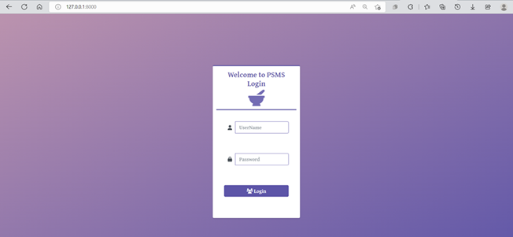
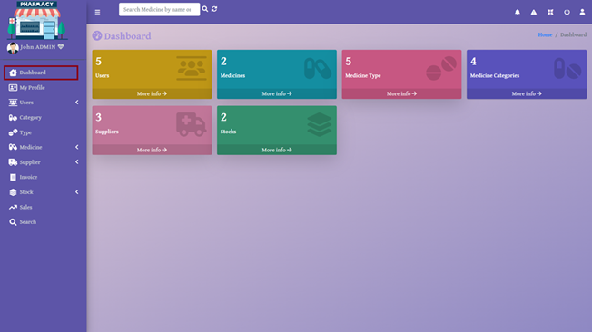
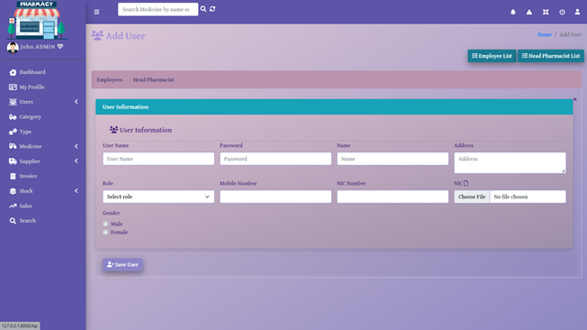
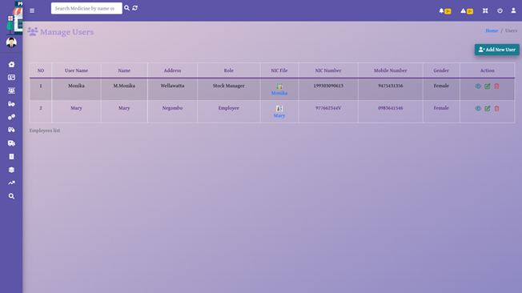
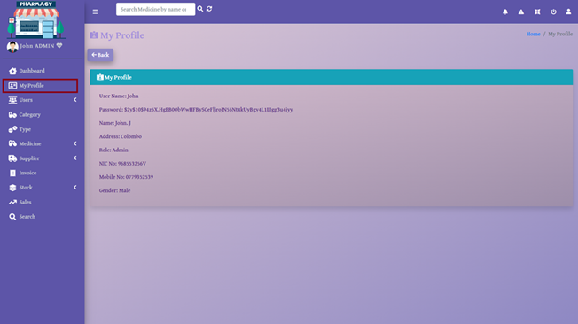
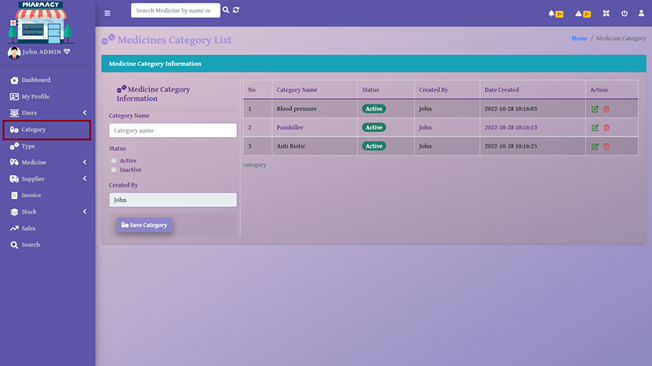
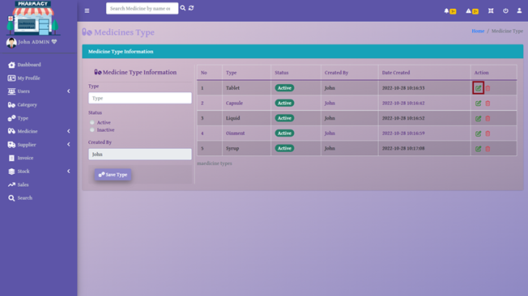
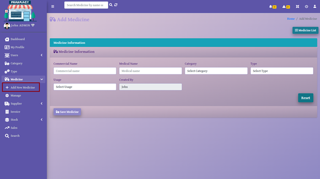
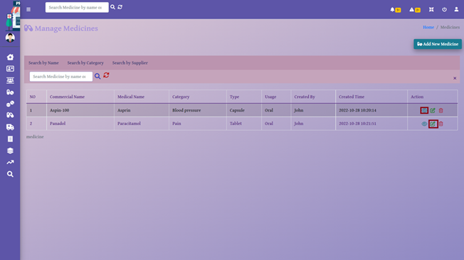
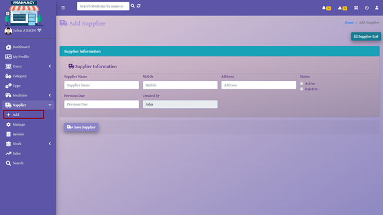
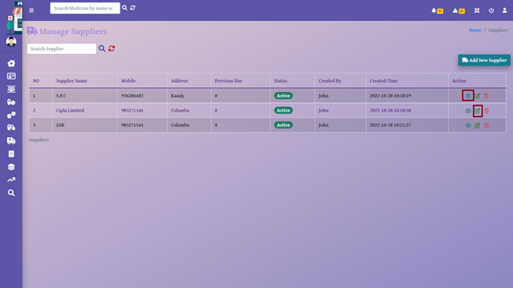
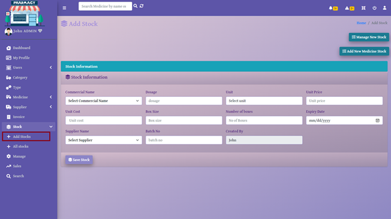
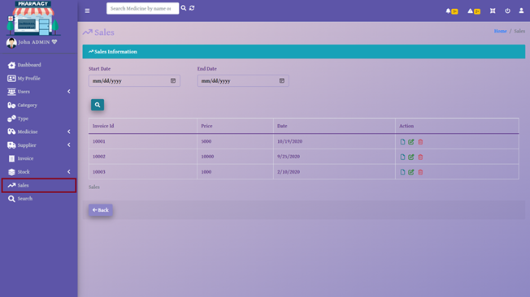
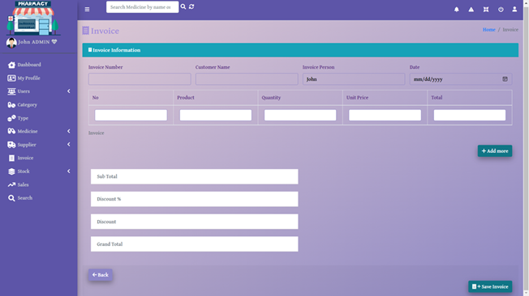
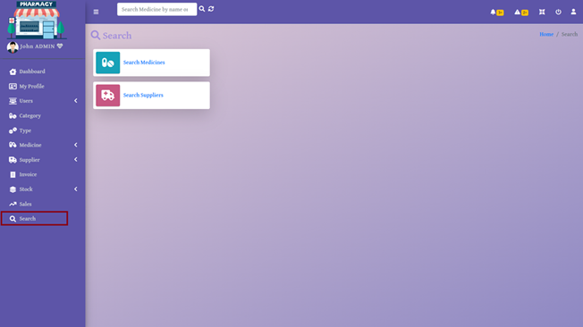
